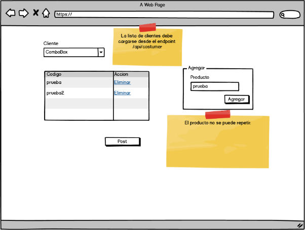
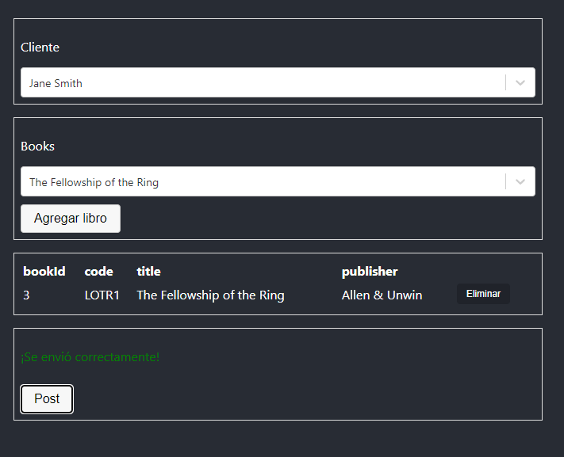

# Library Test Frontend
Este es un proyecto de práctica.

## 1.1 Normalización
En base a la siguiente estructura de datos (se trata de la información de préstamos de libros de una biblioteca), realice la creación de un modelo de datos normalizado que sea capaz de soportarlo. Adjunte el Diagrama Entidad-Relación:

| Código | Título                                   | Autor                           | Editorial | Nombre del lector | Fecha de Devolución |
|--------|------------------------------------------|---------------------------------|-----------|-------------------|---------------------|
| 1001   | La uruguaya                              | Pedro Mairal                    | EMECE     | Goméz, Ana        | 01/01/2021          |
| 1004   | Salvatierra                              | Pedro Mairal                    | EMECE     | Pérez, Juan       | 02/01/2021          |
| 1004   | Salvatierra                              | Pedro Mairal                    | EMECE     | Goméz, Ana        | 01/03/2021          |
| 1005   | El funcionamiento general del mundo      | Eduardo Sacheri Pedro Mairal | Planeta   | Goméz, Ana        | 01/08/2021          |
| 1006   | Ser feliz era esto                       | Eduardo Sacheri                 | Alfaguara | Sánchez, José     | 01/08/2021          |
| 1007   | Cuentos cortos                           | Eduardo Sacheri Pedro Mairal Hernán Casciari | Planeta   | Sánchez, José     | 01/08/2021          |

## 1.2 SQL
En base al modelo normalizado en el punto anterior, escriba las consultas SQL para obtener la siguiente información:

1. Ranking de los diez primeros libros más solicitados, incluyendo: Nombre del libro, autor, editorial y cantidad de veces que ha sido retirado. Ordenar los resultados de mayor a menor cantidad.
2. Listado de títulos y su cantidad de autores. Se debe visualizar: Título y cantidad de autores. Solo visualizar aquellos registros donde hayan más de dos autores.
3. Listado de los lectores y cuantas veces han retirado un determinado libro: Lector, libro, cantidad de retiros. 
4. Listado de libros y cuántas veces fueron retirados por mes en el último año. Contemplar aquellos meses donde no hubo retiros como 0. El resultado debe otorgar: Código de libro, Título, Mes y año, Cantidad de libros. 
5. Para cada lector, se debe visualizar cuál es su autor de preferencia (aquel autor que más libros ha retirado): Código de lector, nombre del lector, código de autor y autor.

## 2. Desarrollo
Se deberán realizar las siguientes acciones propuestas, referidas a un sistema cuyo objetivo es la emisión de una factura (invoice) con sus correspondientes detalles (invoice items) relacionada a un cliente específico (customer).

## 2.1 Backend
Para alcanzar el objetivo antes mencionado, se dispondrá de una estructura de proyecto en el lenguaje .NET CORE. Dentro del proyecto, se le deberá agregar la siguiente funcionalidad dentro del/los Controllers que considere necesarios:

- Alta de Customer (Cliente)
- Obtención de listado completo de Customers (Clientes)
- Creación de una nueva Invoice (Factura) con sus correspondientes  detalles

Los puntos antes resueltos deberán ser utilizados para la resolución de la problemática propuesta en el punto siguiente.

## 2.2 Frontend
En base al siguiente modelo de interfaz (tentativa, aplique las mejoras que considere necesarias), se deberá seleccionar un cliente (desde un menú desplegable con la obtención de la información desde el servicio antes creado); y agregar los productos que conformarán parte de la factura (no pueden repetirse los mismos para la factura que se está confeccionando). 

Una vez concluida la carga, mediante un botón se deberá enviar la información ya validada.

## Solución
## Ejercicio 2.2

